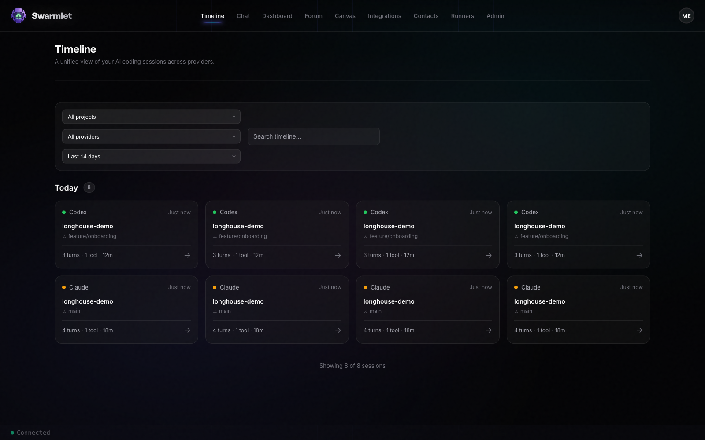

<h1 align="center">🪵 Longhouse</h1>

<p align="center">
  <strong>Never lose an AI coding conversation again</strong>
</p>

<p align="center">
  <a href="https://github.com/cipher982/longhouse/actions"></a>
  <a href="https://pypi.org/project/longhouse/"></a>
  <a href="https://github.com/cipher982/longhouse/blob/main/LICENSE"></a>
  <a href="https://github.com/cipher982/longhouse"></a>
</p>

---

## The Problem

You use Claude Code, Codex, Cursor, Gemini. Each stores sessions in obscure JSONL files scattered across your filesystem.

Need to find that conversation from last Tuesday where the AI suggested the fix for your auth bug? Good luck grepping through thousands of lines of JSON.

## The Solution

**Longhouse watches your AI coding sessions and unifies them into a searchable timeline.**



- **Search across all tools** - Claude, Codex, Cursor, Gemini in one timeline
- **Find anything** - Search by project, date, tool used, or conversation content
- **Resume work** - See what you worked on, when, and pick up where you left off
- **Learn from history** - "How many times did I refactor this? What worked?"
- **Local-first** - Your data stays on your machine (SQLite)

---

## Quick Start

```bash
pip install longhouse
longhouse onboard
```

That's it. The wizard starts the server and opens your browser.

Or with the full installer (includes Python setup):

```bash
curl -fsSL https://get.longhouse.ai/install.sh | bash
```

---

## What Happens Next

After install:

1. **Server starts** automatically (or run `longhouse serve`)
2. **Browser opens** to http://localhost:8080
3. **Timeline appears** with demo sessions (or empty if you prefer)
4. **Connect your tools:**
   ```bash
   longhouse connect  # Syncs Claude Code sessions in realtime
   ```

Your Claude Code sessions will appear in the timeline as you work.

---

## Commands

```bash
longhouse serve      # Start the server
longhouse connect    # Sync Claude Code sessions (continuous)
longhouse ship       # One-time sync
longhouse status     # Show configuration
longhouse onboard    # Re-run setup wizard
```

---

## Features

- ✅ **Multi-tool support** - Claude Code (live), Codex, Cursor, Gemini (coming soon)
- ✅ **Local-first** - SQLite database, your data stays on your machine
- ✅ **Search** - Find sessions by content, project, date, tool
- ✅ **Timeline view** - See all your AI work in one place
- ✅ **Real-time sync** - Sessions appear as you work
- ✅ **Session detail** - View full conversation, tool calls, file changes
- 🚧 **Session resume** - Continue conversations across tools (in progress)
- 🚧 **Cross-tool search** - "Show me all auth-related conversations" (in progress)

---

## For Contributors

Full dev setup with hot reload:

```bash
git clone https://github.com/cipher982/longhouse.git
cd longhouse
make dev  # Starts backend + frontend
```

Run tests:

```bash
make test          # Unit tests
make test-e2e      # End-to-end tests
```

---

## Architecture

```
User → CLI (longhouse) → FastAPI backend → SQLite (~/.longhouse/longhouse.db)
                       ↓
                  React frontend (localhost:8080)
```

**Stack:**
- Backend: Python 3.12+, FastAPI, SQLAlchemy, SQLite
- Frontend: React 19, TypeScript, Vite
- CLI: Typer, uv

---

## Why "Longhouse"?

Traditional longhouses were communal structures where tribes gathered and preserved history. Your Longhouse is where all your AI coding sessions gather and persist.

Each session is a log 🪵 in your timeline.

---

## Status

**Alpha** - Actively developed, expect changes. Currently works with Claude Code, more tools coming soon.

---

## License

ISC - see LICENSE file

---

## Links

- **Documentation:** https://longhouse.ai/docs
- **Issues:** https://github.com/cipher982/longhouse/issues
- **PyPI:** https://pypi.org/project/longhouse/
