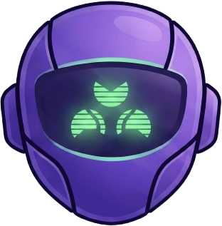

<p align="center">
  
</p>

<h1 align="center">Zerg + Jarvis (Unified)</h1>

<p align="center">
  <strong>Supervisor + Workers with a unified single-origin UI.</strong>
</p>

Zerg is the supervisor/worker orchestration backend. Jarvis is the voice/text UI. They now ship behind one nginx entrypoint for same-origin UX.

---

## Current Architecture

```
User → http://localhost:30080 (nginx)
  /            → Unified React SPA (dashboard + /chat)
  /dashboard   → Zerg dashboard (alias)
  /chat        → Jarvis chat UI (SPA route)
  /api/*       → Zerg FastAPI backend (includes Jarvis BFF at /api/jarvis/*)
  /ws/*        → Zerg WS (SSE/WS)

Backend: FastAPI + LangGraph-free supervisor/worker agents (workflow engine uses LangGraph)
Workers: disposable agents, artifacts under /data/workers
Frontend: Unified React SPA (Zerg dashboard + Jarvis chat), served same-origin
```

Ports (dev): nginx 30080 external; service ports 47200 (frontend), 47300 (backend).

---

## Highlights

- **Durable Runs (v2.2):** Runs survive disconnects and timeouts. `asyncio.shield()` prevents server-side cancellation on client timeout; `DEFERRED` state for long-running work.
- **Worker supervision (v2.1):** tool events, activity ticker, roundabout monitoring (heuristic warnings, no auto-cancel), fail-fast critical errors.
- **Supervisor tool visibility (v2.2):** supervisor-direct tool calls emit SSE tool events and render as inline ToolCards in chat.
- **Unified frontend (v2.1):** single origin, CORS tightened, cross-nav links, Playwright e2e green.
- **Bun-only JS workspace:** single `bun.lock`; Python via `uv`.
- **Same-origin auth (dev):** `AUTH_DISABLED=1` backend, `VITE_AUTH_ENABLED=false` in `docker/docker-compose.dev.yml`; enable auth in prod.

---

## Commands

- `make dev` – brings up unified stack with nginx front.
- Tests: `make test` (unit), `make test-e2e`, `make test-all`, `make test-chat-e2e`, `make test-perf` (latency).
- Prompt Iteration: `cd apps/zerg/backend && uv run python scripts/replay_run.py <run_id>`
- Codegen: `make generate-sdk`, `make regen-ws`.

---

## Health Checks (Production)

- Unified Health: `https://swarmlet.com/health`
- Backend Readiness: `https://swarmlet.com/api/system/health`
- Smoke Test: `./scripts/smoke-prod.sh`

---

## Project Structure

```
apps/
└── zerg/
    ├── backend/        # FastAPI + LangGraph-free supervisor/worker
    ├── frontend-web/   # React dashboard
    └── e2e/            # Playwright unified tests

docker/                 # Compose files + nginx reverse-proxy configs
docs/                   # Specs/PRDs (see below)
scripts/                # Dev tools + generators
```

---

## Docs to know

- `docs/specs/worker-supervision-roundabout.md` – phases 1–6 complete, matches code.
- `docs/specs/durable-runs-v2.2.md` – durable runs (current core architecture).
- `docs/specs/jarvis-supervisor-unification-v2.1.md` – supervisor/Jarvis unification (v2.1).
- `docs/archive/super-siri-architecture.md` – v2.0 overall vision (historical).
- `docs/completed/frontend-merge-jarvis-into-zerg-spa.md` – unified SPA merge notes (completed).
- `docs/completed/frontend-alignment-spec.md` – frontend alignment plan (completed).
- `docs/PERFORMANCE_ANALYSIS.md` – Jarvis chat performance investigation + replication notes.
- `docs/specs/supervisor-ui-spec.md` – pending (future UI work).
- `docs/DEPLOYMENT.md` – production deployment guide (Coolify + `docker/docker-compose.prod.yml`).
- `docs/DEVELOPMENT.md` – local dev guide (`make dev` + `docker/docker-compose.dev.yml` profile `dev`).

---

## License

ISC
