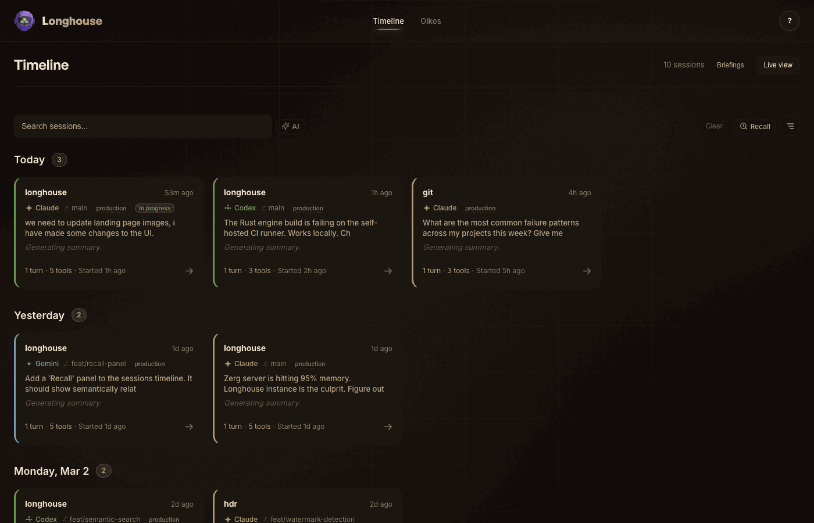

# Longhouse

Self-hosted mission control for the CLI coding agents you already run. One searchable timeline for every Claude Code, Codex, Antigravity, and OpenCode session across the machines you own — with live remote control where the provider CLI supports it.

Not sandboxed cloud agents. Not a single-vendor dashboard. Yours.

Works on your laptop. Shines on a machine that stays on.



## Why

If you run coding agents seriously, you run a lot of them — across a laptop and maybe an always-on box. Today that history is scattered across `~/.claude`, terminal scrollback, and one local log dir per tool, and a session dies when the laptop sleeps.

Longhouse fixes that:

- **Find any past session in seconds** — one timeline + full-text search across every provider and machine.
- **Steer live work remotely** — launch a session through Longhouse and send to it later from the web or your phone.
- **Own your history** — runs on machines you control, SQLite at the core, nothing uploaded to a vendor cloud.

## Install

**macOS (recommended):** download [Longhouse for macOS](https://longhouse.ai/download/macos). Open the app to finish setup.

**Shell installer** (Linux, WSL, or Mac without the app):

```bash
curl -fsSL https://get.longhouse.ai/install.sh | bash
longhouse onboard            # Linux/WSL. On macOS, open Longhouse.app instead — it owns first-run setup.
```

**Power users / agents:**

```bash
uv tool install longhouse
longhouse onboard
```

All three install the same product. On macOS the shell installer also drops `Longhouse.app` into `/Applications` — open it to finish setup rather than running `longhouse onboard`.

## First Session

```bash
longhouse claude       # managed session, steerable later
longhouse codex        # same, for Codex CLI
longhouse agy          # managed observe-only launch for Antigravity CLI
longhouse opencode     # managed live-control launch for OpenCode
```

Bare `claude`, `codex`, `antigravity`, and `opencode` still get ingested into the timeline — they just stay unmanaged (searchable, not steerable).

The web UI lives at `http://localhost:8080`. The same surface is scriptable:

```bash
longhouse wall --json
longhouse recall "that auth refresh bug from last week"
longhouse tail <session-id>
```

## Durable Self-Host

A laptop runtime stops when the laptop sleeps. For real durability, run the Runtime Host on an always-on box (VPS, homelab, Mac mini) and point your dev machines at it.

**On the always-on box** — a public bind requires auth, so set it up first:

```bash
export LONGHOUSE_PASSWORD_HASH="$(longhouse hash-password)"   # prompts for a password
export JWT_SECRET=$(openssl rand -hex 32)
export INTERNAL_API_SECRET=$(openssl rand -hex 32)

longhouse serve --host 0.0.0.0 --domain longhouse.example.com
```

**On each dev machine:**

```bash
longhouse connect --domain longhouse.example.com --install
```

Binding beyond localhost without auth is refused by default — `longhouse serve` exits and tells you what to set. The three exports above are the whole requirement: a password hash plus two random secrets. (If a trusted reverse proxy already authenticates requests, pass `--allow-public-no-auth` to accept the risk.) For TLS, put Caddy in front — `reverse_proxy 127.0.0.1:8080` is the whole config.

Or skip running the box — hosted (we run the Runtime Host for you) is available at <https://control.longhouse.ai/signup>.

## Repair

```bash
longhouse doctor              # diagnose
longhouse upgrade             # update CLI
longhouse machine repair      # repair a configured machine
longhouse connect --install   # first install or force reinstall
```

`longhouse --help` lists every subcommand. Full docs: <https://longhouse.ai/docs>.

## Architecture

Two public components, one product:

- **Machine Agent** — Rust engine on each dev machine. Ships session events.
- **Runtime Host** — FastAPI + bundled web UI + SQLite. Lives where durability should live.

On a laptop both run together for trial use. For durability, separate them. See `VISION.md` for the full product thesis.

## How It Compares

There are great tools for spinning up sandboxed cloud agents, and the model labs now ship their own single-vendor dashboards. Longhouse sits in a different spot: the sessions you *already run*, on hardware you own, across every provider.

| | Longhouse | Lab dashboards (Agent View, Codex, Antigravity) | Cloud agents (Devin, Cursor, Jules) |
|---|:---:|:---:|:---:|
| Cross-provider (Claude Code + Codex + more) | ✅ | ❌ single vendor | ❌ |
| Runs on machines you own | ✅ | ⚠️ cloud-tethered | ❌ cloud VM |
| Live remote control of real sessions | ✅ managed | ✅ own provider only | n/a |
| Self-hostable | ✅ | ❌ | ❌ |
| You own & can export the raw history | ✅ | ❌ | ❌ |

Honest scope today: managed live control is strongest for **Claude Code and Codex**; **OpenCode supports managed send, interrupt, launch, and terminate, but not active-turn steer or pause-answer**; **Antigravity is observe-only** at the control layer. Bare CLI runs are imported and searchable but not steerable. See **Managed vs Unmanaged** in the docs.

## Self-host (free) vs Hosted (paid)

The Apache-2.0 core in this repo is fully usable on your own machines — no account, no control plane, no time limit. Self-host is the default truth, not a crippled tier.

Hosted (<https://control.longhouse.ai/signup>) exists for people who don't want to run an always-on box. We run the Runtime Host for you: always-on durability, zero-setup multi-machine sync, and iOS push when a session needs you — the things a sleeping laptop can't do. Same product, we just operate the box.

## Open Core

This repository is the Apache-2.0 Longhouse core: CLI, Machine Agent, Runtime Host, web UI, self-hosting, and client surfaces over the same machine contracts.

Longhouse Cloud's hosted signup, billing, provisioning, fleet operations, and deployment automation are proprietary and live outside this repository. The public Runtime Host can integrate with a hosted control plane by URL, but self-hosted Longhouse does not require it.

See `EDITIONS.md` and `TRADEMARKS.md` for the boundary, and `NOTICE` for attribution.

## Contributing

```bash
git clone https://github.com/cipher982/longhouse.git
cd longhouse
make dev        # backend + frontend with hot reload
make test       # unit tests
make test-e2e   # end-to-end
```

See [`CONTRIBUTING.md`](CONTRIBUTING.md) for dev setup, test tiers, and the codegen flow, and [`ARCHITECTURE.md`](ARCHITECTURE.md) for the system map and a glossary of the project's nouns (managed vs unmanaged, Machine Agent vs Runtime Host, wall, recall, …).

Issues: <https://github.com/cipher982/longhouse/issues>

## Status

Alpha. Actively developed. Claude Code, Codex, Antigravity, and OpenCode sessions sync today. Managed launch is live for Claude, Codex, Antigravity, and OpenCode (Antigravity is observe-only; OpenCode supports managed send, interrupt, launch, and terminate, but not active-turn steer or pause-answer), and the native iOS companion can page on `needs_user` / `blocked` once APNs is configured.

Built by [David Rose](https://github.com/cipher982). Apache-2.0.

<!-- readme-test: verifies install from source and health endpoint -->
```readme-test
{
  "name": "longhouse-serve-health",
  "mode": "smoke",
  "workdir": ".",
  "timeout": 600,
  "env": {
    "AUTH_DISABLED": "1",
    "SKIP_DEMO_SEED": "1"
  },
  "steps": [
    "bun install --frozen-lockfile --silent",
    "(cd web && bun run build)",
    "python3 scripts/build/generate_build_identity.py",
    "uv venv .tmp-readme-serve-venv --python 3.12 -q",
    ". .tmp-readme-serve-venv/bin/activate",
    "uv pip install -e server -q",
    "scripts/qa/readme-serve-health-smoke.sh"
  ],
  "cleanup": [
    "rm -rf .tmp-readme-serve-venv"
  ]
}
```

<!-- onboarding-contract:start -->
```json
{
  "workdir": "/tmp/longhouse-onboarding",
  "steps": [
    "cd {{WORKDIR}}/web && bun install --silent && bun run build",
    "cd {{WORKDIR}} && python3 scripts/build/generate_build_identity.py",
    "cd {{WORKDIR}}/server && uv sync",
    "cd {{WORKDIR}}/server && HOME={{WORKDIR}}/.qa-home LLM_DISABLED=1 uv run longhouse serve --host 127.0.0.1 --port 8080 --daemon",
    "sleep 5",
    "python3 -c 'import json,urllib.request; p=json.load(urllib.request.urlopen(\"http://127.0.0.1:8080/api/health\")); assert p.get(\"status\") == \"healthy\", p'",
    "cd {{WORKDIR}}/e2e && bun install --silent && PLAYWRIGHT_BASE_URL=http://127.0.0.1:8080 bunx playwright test --config playwright.onboarding.config.js --project onboarding-chromium"
  ],
  "cleanup": [
    "cd {{WORKDIR}}/server && HOME={{WORKDIR}}/.qa-home uv run longhouse serve --stop || true",
    "rm -rf {{WORKDIR}}/.qa-home"
  ],
  "primary_route": "/timeline",
  "cta_buttons": [
    {
      "label": "Machines",
      "selector": "button:has-text(\"Machines\")"
    }
  ]
}
```
<!-- onboarding-contract:end -->
