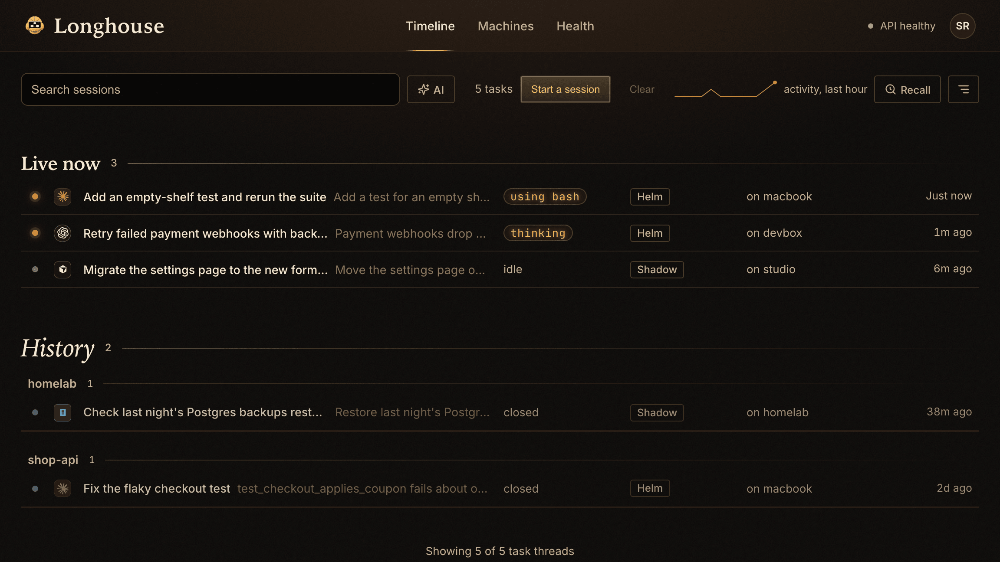

# Longhouse

**Remote control for your coding agents.**

→ **[longhouse.ai](https://longhouse.ai)** · [Download for macOS](https://longhouse.ai/download/macos) · [Hosted](https://control.longhouse.ai/signup) · [Docs](https://longhouse.ai/docs)

Watch any Claude Code, Codex, Cursor, or OpenCode session live from the web. Search everything they've done. Send your next instruction while the agent keeps running in its real terminal on your machine. Apache-2.0 open core.



## Why

If you run coding agents often it gets messy quick across the terminal tabs and transcripts. Today that history is scattered across `~/.claude`, terminal scrollback, or one local log dir per tool.

Longhouse fixes that:

- **Find any past session in seconds** — one timeline + full-text search across every provider and machine.
- **Control live work remotely** — launch a session through Longhouse, then send, interrupt, steer, or resume it later when that provider supports the operation.
- **Own your history** — Longhouse stores its archive in SQLite on your Runtime Host. The provider client still makes its normal requests to its provider.

Longhouse does not replace a provider with its own agent runtime or terminal UI. A bare provider CLI stays observable through its native archive. A managed launch such as `longhouse claude` keeps the stock terminal experience while adding Longhouse's provider-specific control path. The timeline exposes the controls a session can actually perform instead of assuming every provider can steer a live turn.

## Install

**macOS (recommended):** download [Longhouse for macOS](https://longhouse.ai/download/macos). Open the app to finish setup.

**Shell installer** (Linux, WSL, or Mac without the app):

```bash
curl -fsSL https://get.longhouse.ai/install.sh | bash
longhouse auth --url https://your-runtime.example
longhouse machine repair --repair-service
```

The shell installer installs the native pair. On macOS it also drops
`Longhouse.app` into `/Applications`; open it to finish setup. Runtime Host
operators install `longhouse-server` in that server environment.

## First Session

```bash
longhouse claude       # managed Claude Code session
longhouse codex        # managed Codex app-server session
longhouse opencode     # managed OpenCode server session
longhouse cursor       # managed Cursor PTY session
longhouse pi           # managed Pi TUI session
longhouse omp          # managed Oh My Pi TUI session
longhouse antigravity  # managed Antigravity hook session
```

Managed sessions keep the provider's native client and local identity while
adding Longhouse's session-scoped control path. Bare provider sessions remain
Shadow: searchable and observable, but not remotely controlled by Longhouse.
Console is the no-terminal path for sending a turn to a connected machine.

Provider behavior is intentionally capability-specific and changes with the
native clients. Read [Provider Integrations](https://longhouse.ai/docs/integrations)
for the current control and archive details; this README stays focused on the
product shape rather than promising every provider/version/configuration
combination.

The web UI lives at `http://localhost:8080`. Runtime Host administration is a
separate server lane and uses `longhouse-server`:

```bash
longhouse-server status --json
longhouse-server recall "that auth refresh bug from last week"
longhouse-server tail <session-id>
```

## Durability

A laptop runtime stops when the laptop sleeps. For real durability, run the Runtime Host on an always-on box (VPS, homelab, Mac mini) and point your dev machines at it.

| | Self-host | Hosted |
|---|---|---|
| You operate | Runtime Host on a VPS, homelab, or Mac mini | Nothing — we run it |
| Cost | Free (Apache-2.0) | $5/mo |
| Setup | `longhouse-server serve` (steps below) | [control.longhouse.ai/signup](https://control.longhouse.ai/signup) |
| Always-on | Up to you | Yes |
| iOS push on `needs_user` | Yes (APNs config required) | Yes |

**Self-host — on the always-on box:**

```bash
export LONGHOUSE_PASSWORD_HASH="$(longhouse-server hash-password)"   # prompts for a password
export JWT_SECRET=$(openssl rand -hex 32)
export INTERNAL_API_SECRET=$(openssl rand -hex 32)

longhouse-server serve --host 0.0.0.0 --domain longhouse.example.com
```

**On each dev machine:**

```bash
curl -fsSL https://get.longhouse.ai/install.sh | bash
longhouse auth --url https://longhouse.example.com
longhouse machine repair --repair-service
```

Binding beyond localhost without auth is refused by default — `longhouse-server serve` exits and tells you what to set. The three exports above are the whole requirement: a password hash plus two random secrets. (If a trusted reverse proxy already authenticates requests, pass `--allow-public-no-auth` to accept the risk.) For TLS, put Caddy in front — `reverse_proxy 127.0.0.1:8080` is the whole config.

## Repair

```bash
curl -fsSL https://get.longhouse.ai/install.sh | bash  # install or upgrade the native pair
longhouse local-health --json                             # diagnose
longhouse machine repair                               # restart a configured machine
longhouse machine repair --repair-service              # install/repair its native service
```

`longhouse --help` lists the device commands; `longhouse-server --help` lists the Runtime Host ones. Full docs: <https://longhouse.ai/docs>.

## What makes Longhouse different

Other tools spin up sandboxed cloud agents or wrap a single vendor's dashboard. Longhouse unifies the sessions you already run, on hardware you own, across providers. You keep using the official clients and provider plans you already have instead of buying access to another model-backed coding agent.

## Status

Actively developed pre-release. Longhouse currently supports Claude Code, Codex,
Cursor, OpenCode, Antigravity, Pi Agent, and OMP across archive and managed
control paths. The exact operation support is capability-specific; see
[Provider Integrations](https://longhouse.ai/docs/integrations) and the
in-product provider view for current details. This README is not a
compatibility matrix.

The iOS client lives in `ios/` and handles APNs push on `needs_user`, but there is no
TestFlight or App Store build and no `.ipa` in any release. Getting it on a phone today
means opening `ios/XcodeHarness` in Xcode and running it onto your own device.

See [RELEASE.md](RELEASE.md) for how releases are cut.

Built and maintained by [David W. Rose](https://drose.io/)
([cipher982](https://github.com/cipher982)). Apache-2.0.

## Architecture

- **Machine Agent** — Rust engine on each dev machine. Ships session events.
- **Runtime Host** — FastAPI + bundled web UI + SQLite. Lives where durability should live.

On a laptop both run together for trial use. For the full system map, component detail, and a glossary of the project's nouns (Shadow/Helm/Console, wall, recall, peers, …) see [`ARCHITECTURE.md`](ARCHITECTURE.md) and [`VISION.md`](VISION.md).

For code navigation, start with `server/`, `web/`, and `engine/` for the core
runtime; `ios/`, `desktop/`, and `runner/` for clients and support; and
`schemas/`, `config/`, and `scripts/` for contracts and tooling. The
[contributor guide](CONTRIBUTING.md#project-layout) has the complete tree.

## Contributing

```bash
git clone https://github.com/cipher982/longhouse.git
cd longhouse
make dev        # local UI with hot reload against your linked Runtime Host
make dev-demo   # isolated local backend + seeded demo UI
make test       # unit tests
make test-e2e   # end-to-end
```

Good entry points: web timeline UI, additional provider-CLI ingest parsers, CLI subcommand UX, and docs. Look for [`good first issue`](https://github.com/cipher982/longhouse/labels/good%20first%20issue) labels.

See [`CONTRIBUTING.md`](CONTRIBUTING.md) for dev setup, test tiers, the codegen flow, and the open-core boundary. [`EDITIONS.md`](EDITIONS.md) has the line between the Apache-2.0 core and Longhouse Cloud.

Issues: <https://github.com/cipher982/longhouse/issues>

---

→ **[longhouse.ai](https://longhouse.ai)**

<!-- readme-test: verifies install from source and health endpoint -->
```readme-test
{
  "name": "longhouse-serve-health",
  "mode": "smoke",
  "workdir": ".",
  "timeout": 600,
  "env": {
    "AUTH_DISABLED": "1",
    "SKIP_DEMO_SEED": "1"
  },
  "steps": [
    "bun install --frozen-lockfile --silent",
    "(cd web && bun run build)",
    "python3 scripts/build/generate_build_identity.py",
    "uv venv .tmp-readme-serve-venv --python 3.12 -q",
    ". .tmp-readme-serve-venv/bin/activate",
    "uv sync --frozen --active --no-dev --project server --quiet",
    "scripts/qa/readme-serve-health-smoke.sh"
  ],
  "cleanup": [
    "rm -rf .tmp-readme-serve-venv"
  ]
}
```

<!-- onboarding-contract:start -->
```json
{
  "workdir": "/tmp/longhouse-onboarding",
  "steps": [
    "cd {{WORKDIR}}/web && bun install --silent && bun run build",
    "cd {{WORKDIR}} && python3 scripts/build/generate_build_identity.py",
    "cd {{WORKDIR}}/server && uv sync",
    "cd {{WORKDIR}}/server && HOME={{WORKDIR}}/.qa-home LLM_DISABLED=1 uv run longhouse-server serve --host 127.0.0.1 --port 8080 --daemon",
    "sleep 5",
    "python3 -c 'import json,urllib.request; p=json.load(urllib.request.urlopen(\"http://127.0.0.1:8080/api/health\")); assert p.get(\"status\") == \"healthy\", p'",
    "cd {{WORKDIR}}/e2e && bun install --silent && PLAYWRIGHT_BASE_URL=http://127.0.0.1:8080 bunx playwright test --config playwright.onboarding.config.js --project onboarding-chromium"
  ],
  "cleanup": [
    "cd {{WORKDIR}}/server && HOME={{WORKDIR}}/.qa-home uv run longhouse-server serve --stop || true",
    "rm -rf {{WORKDIR}}/.qa-home"
  ],
  "primary_route": "/timeline",
  "cta_buttons": [
    {
      "label": "Machines",
      "selector": "button:has-text(\"Machines\")"
    }
  ]
}
```
<!-- onboarding-contract:end -->
