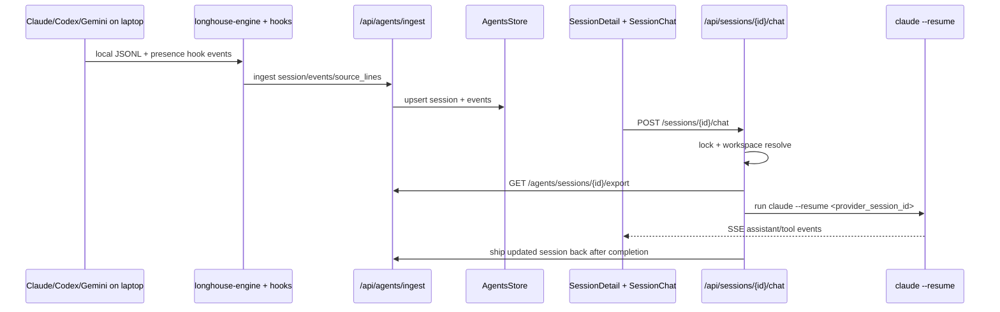

# Oikos + Commis Deep Dive (2026-03)

Status: current-state analysis with refactor plan
Last verified against code: 2026-03-03

## 1) Canonical mental model (the confusion to kill)

`Commis` is not a model family and not a provider.

- Oikos = coordinator loop (user-facing assistant run orchestration)
- Commis = delegated background job abstraction (`CommisJob`) that executes a CLI agent in workspace/scratch
- Backend/provider for a commis can be Claude/Codex/Gemini/z.ai (selected via `backend`/`model`)

So:

- Interactive session chat resume (`/api/sessions/{id}/chat`) is **not** commis.
- Background delegated work from Oikos (`spawn_commis*`) **is** commis.

This matches your target model:

1. interactive resume (drop into a session directly)
2. background resume (Oikos delegates and later continues via commis completion)

These are different execution paths, even though both eventually use provider sessions.

## 2) Current architecture map

### Core runtime planes

1. Timeline/session archive plane
- Ingest/export/search lives in:
  - `apps/zerg/backend/zerg/routers/agents.py`
  - `apps/zerg/backend/zerg/services/agents_store.py`
- Lossless source-of-truth for session lines is `agents.source_lines` with JSONL export support.

2. Interactive resume plane (direct user -> provider session)
- `apps/zerg/backend/zerg/routers/session_chat.py`
- `apps/zerg/backend/zerg/services/session_continuity.py`
- `apps/zerg/frontend-web/src/components/SessionChat.tsx`
- `apps/zerg/frontend-web/src/pages/SessionDetailPage.tsx`

3. Oikos orchestration plane (assistant loop + delegation)
- `apps/zerg/backend/zerg/services/oikos_service.py`
- `apps/zerg/backend/zerg/services/oikos_react_engine.py`
- `apps/zerg/backend/zerg/tools/builtin/oikos_tools.py`
- `apps/zerg/backend/zerg/routers/oikos_chat.py`

4. Commis execution + resume plane
- `apps/zerg/backend/zerg/services/commis_job_processor.py`
- `apps/zerg/backend/zerg/services/cloud_executor.py`
- `apps/zerg/backend/zerg/services/commis_resume.py`
- `apps/zerg/backend/zerg/models/commis_barrier.py`

5. Stream/event plane
- `apps/zerg/backend/zerg/routers/stream.py`
- `apps/zerg/backend/zerg/services/event_store.py`
- `apps/zerg/backend/zerg/events/*`

## 3) End-to-end flows

### A. Ship session from laptop -> interactive resume from web



Key point: this path bypasses commis entirely.

### B. Oikos delegation -> background commis -> oikos resume (single)

```mermaid
sequenceDiagram
  participant User
  participant OChat as /api/oikos/chat
  participant Oikos as OikosService.run_oikos
  participant Loop as oikos_react_engine
  participant Tool as spawn_commis
  participant Queue as commis_jobs
  participant Proc as CommisJobProcessor
  participant Exec as CloudExecutor(hatch)
  participant Resume as commis_resume.resume_oikos_with_commis_result

  User->>OChat: message
  OChat->>Oikos: run_oikos(run_id)
  Oikos->>Loop: runner.run_thread()
  Loop->>Tool: spawn_commis(...)
  Tool->>Queue: insert CommisJob(status=queued, execution_mode=workspace)
  Loop-->>Oikos: FicheInterrupted(waiting)
  Oikos-->>User: oikos_waiting (SSE stays open)
  Proc->>Queue: claim queued job
  Proc->>Exec: run_commis(task, backend/model/workspace)
  Exec-->>Proc: result/status
  Proc->>Resume: resume_oikos_with_commis_result(...)
  Resume->>Oikos: continuation injection (tool_call_id-bound)
  Oikos-->>User: oikos_complete
```

### C. Parallel spawn barrier path (race-safe)

```mermaid
sequenceDiagram
  participant Loop as oikos_react_engine
  participant Oikos as OikosService
  participant Barrier as commis_barriers
  participant Jobs as commis_jobs
  participant Proc as CommisJobProcessor
  participant Resume as commis_resume.check_and_resume_if_all_complete

  Loop->>Jobs: create N jobs status=created
  Loop-->>Oikos: interrupt_value(commiss_pending, job_ids)
  Oikos->>Barrier: create barrier + barrier_jobs
  Oikos->>Jobs: flip created -> queued (single tx)
  Proc->>Jobs: execute jobs concurrently
  Proc->>Resume: report each completion
  Resume->>Barrier: atomic completed_count increment
  Resume->>Oikos: trigger batch resume only once when all complete
```

### D. Continuation chain path (commis completes after original run terminal)

When original run is already terminal, `trigger_commis_inbox_run()` creates a continuation run (`continuation_of_run_id`, `root_run_id`) and runs Oikos again with synthetic inbox task.

Primary code:
- `apps/zerg/backend/zerg/services/commis_resume.py:1235`

## 4) Where complexity currently lives (measured)

Top complexity hotspots by file length:

- `routers/agents.py` ~2620
- `tools/builtin/oikos_tools.py` ~1690
- `services/commis_resume.py` ~1614
- `services/oikos_service.py` ~1394
- `services/oikos_react_engine.py` ~975
- `services/commis_job_processor.py` ~871

Combined Oikos+Commis core (`oikos_service` + `oikos_react_engine` + `oikos_tools` + `commis_resume` + `commis_job_processor`) is ~6544 LOC and contains repeated lifecycle/event patterns.

## 5) Forum impact analysis (how much can be cleaned)

Current state:
- `/forum` route is already soft-disabled and redirected to timeline/session resume.
- Forum map code is parked under `frontend-web/src/legacy/forum`.

### If we keep "bones" and keep disabled route (recommended now)
- Keep redirect behavior + legacy code parked.
- Keep live sessions API/presence because timeline still uses live panel.
- Additional cleanup now is mostly guardrails and naming consistency.

### If we remove only forum visualization (safe, medium)
- Candidate removals:
  - `frontend-web/src/pages/ForumPage.tsx`
  - `frontend-web/src/legacy/forum/*`
  - `frontend-web/src/styles/forum.css`
  - forum page tests
- Approx deletion: ~2.5k LOC (code + tests + CSS)

### If we remove all live-presence UX (larger product change)
- Additional candidate removals:
  - `/api/agents/sessions/active` route and response models
  - `/api/agents/presence` ingest route
  - `SessionPresence` model
  - hook presence outbox logic in `services/shipper/hooks.py`
  - active session filters and user_state actions tied to live view semantics
- This is no longer a “forum-only” cleanup. It changes timeline behavior.

## 6) Recommended refactor sequence (small PR slices)

### Phase 0 (done)
- Workspace-only commis execution semantics.
- Forum route disabled + legacy quarantine.

### Phase 1 (next, low risk)
- Extract lifecycle/event helpers shared by `oikos_service.py` and `commis_resume.py`:
  - `emit_oikos_waiting`
  - `emit_oikos_complete`
  - `emit_oikos_failure`
  - shared pending-commis stream_control check
- Goal: remove duplicated event/status plumbing and reduce drift bugs.

### Phase 2 (medium)
- Split `oikos_tools.py` by responsibility:
  - `commis_spawn_tools.py` (`spawn_*`, `wait_for_commis`)
  - `commis_query_tools.py` (`read/list/metadata/evidence`)
  - `session_picker_tool.py`
- Keep `get_oikos_allowed_tools()` as the single aggregator.

### Phase 3 (medium/high)
- Split `commis_resume.py` into:
  - `commis_barrier_resume.py` (parallel barrier mechanics)
  - `commis_single_resume.py` (single tool_call continuation)
  - `commis_inbox_continuation.py` (post-terminal continuation chains)
- Clarify one state machine per file.

### Phase 4 (medium)
- Collapse Oikos entrypoints and run-dispatch duplication:
  - `oikos_chat.py` and `oikos_run_dispatch.py` both create runs and start background tasks.
  - unify on one run-start service with explicit mode flags.

### Phase 5 (optional product cleanup)
- Hard-delete legacy forum UI code once you decide there is no short-term re-enable path.

## 7) Specific answer: “is this a commis?”

Use this rule:

- User is directly chatting with an existing provider session in timeline -> **not commis**
- Oikos delegates work asynchronously and tracks a `CommisJob` row -> **commis**

That remains true regardless of provider backend (Claude/Codex/Gemini/z.ai).

## 8) Immediate guardrails added for this direction

- Frontend route guardrail test for legacy forum redirect semantics.
- Backend guardrail tests asserting `spawn_commis` and `spawn_workspace_commis` always persist `execution_mode=workspace`.
